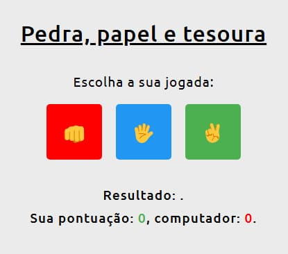

# 🪨 Pedra, Papel e Tesoura

Este é um jogo clássico de **Pedra, Papel e Tesoura**, desenvolvido com **HTML, CSS e JavaScript**, como prática de manipulação do DOM, lógica condicional e interatividade na web.

## 🎮 Como funciona

- O usuário escolhe entre pedra, papel ou tesoura clicando em um dos botões com emojis representativos
- O computador faz uma escolha aleatória dentre as opções pedra, papel e tesoura
- O resultado da rodada é exibido dinamicamente na tela: vitória, derrota ou empate, seguido dos valores escolhidos pelo usuário e computador
- A pontuação do jogador, do computador e de empates é atualizada em tempo real

## ✨ Funcionalidades

- 🎲 Escolha aleatória do computador
- 👆 Botões com ícones de fácil interação
- 🟢 Feedback visual com cores (vitória, derrota ou empate)
- 📊 Placar em tempo real (pontuação do usuário, do computador e empates)
- 📱 Layout simples e responsivo

## 🧠 O que foi praticado

- Lógica condicional com JavaScript
- Manipulação do DOM
- Estrutura e semântica com HTML5
- Estilização e responsividade com CSS3

## Prévia

## 🕹️ Jogue agora

Quer testar suas habilidades contra o computador? <a href="https://game-rock-paper-scissors-sigma.vercel.app/">Clique aqui</a> para jogar diretamente do seu navegador

## 📄 Licença

Este projeto está licenciado sob a MIT License — veja o arquivo <a href="https://github.com/alcamarano/game-rock-paper-scissors/blob/main/LICENSE">LICENSE</a> para mais informações.
